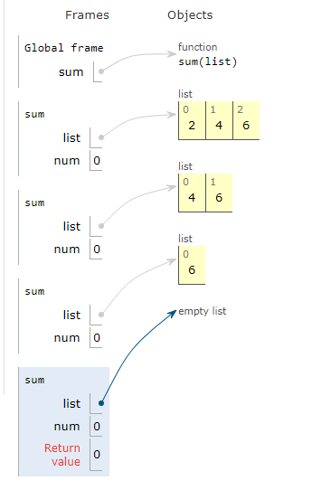

# Algoritms
## divide_and_conquer.py 
### Реализация алгоритма "Разделяй и влавствуй" на примере суммы чисел
1. Необходимо получить "базовый случай" - массив из одного или нуля элементов
2. Каждый рекурсивный вызов приближает к пустому массиву 
3. При "схлопывании" рекурсий рассчитывается сумма от базового случая к результату
```
    if len(list) == 0:
        """Сама функция"""
        return 0
    else:
        num = list[0] + sum(list[1:])
    return num
```


Демонстрация рекурсивных вызовов


***Источник: Адитья Бхаргава: Грокаем алгоритмы***
