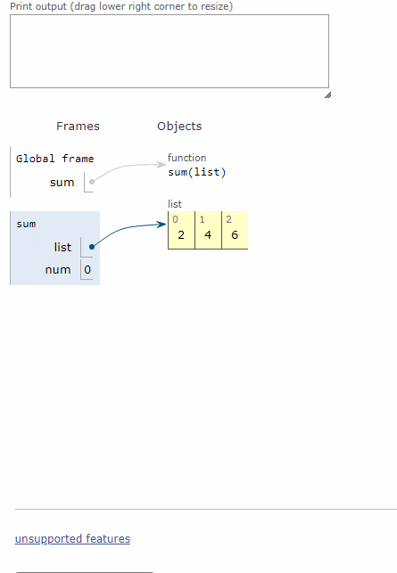

# Algorithms
## divide_and_conquer.py 
### Реализация алгоритма "Разделяй и влавствуй" на примере суммы чисел
1. Необходимо получить "базовый случай" - массив из одного или нуля элементов
2. Каждый рекурсивный вызов приближает к пустому массиву 
3. При "схлопывании" рекурсий рассчитывается сумма от базового случая к результату
```
    if len(list) == 0:
        """Сама функция"""
        return 0
    else:
        num = list[0] + sum(list[1:])
    return num
```
Суммируется первый элемент массива и сумма оставшихся.
Таким образом при каждом рекурсивном вызове размер массива будет уменьшаться 



***Источник - Адитья Бхаргава: Грокаем алгоритмы***

## binary_search.py

## knapsack.py
### Задача о непрерывном рюкзаке
Необходимо рассчитать максимальную стоимость предметов помещающихся в рюкзак
**Входные данные:** n - количество предметов, w - вместимость рюкзака
/c - стоимость предмета, w - объем предмета (n предметов)/
**Выходные данные:** максимальная стоимость поместившихся предметов
(допускается деление предметов на части для оптимальности решения)


Для решешия задачи необходимо отсортировать предметы по убыванию удельной стоимости - C/W:
```
def funcsort(x):
    """Сортируем по убыванию стоимости"""
    return int(x[0]) / int(x[1])

list_items = sorted(list_items, key=funcsort, reverse=True)
print(list_items)

for item in list_items:
    """Удостоверяемся в убывании стоимости"""
    print("C/W предмета №", list_items.index(item), "-", funcsort(item))
```
```
[['120', '30'], ['60', '20'], ['100', '50']]
C/W предмета № 0 - 4.0
C/W предмета № 1 - 3.0
C/W предмета № 2 - 2.0
```
120, 30 - самый дорогой предмет, далее по убыванию

Теперь главный алгоритм в цикле:
1. Если предмет полностью помещяется в заданный объем, добавляем его
2. Если равен или превосходит заданный объем, делим на части с точностью до килограмма, то есть:
C/W (item[0]/item[1]) - стоимость за килограмм 
W + 1 - добавляем килограмм за итерацию
```
    elif w_current + float(item[1]) >= w:
        """Делим на части и добавляем по килограмму"""
        for num in range(int(item[1])):
            if int(w_current) == int(w):
                break
            c_current += float(item[0]) / float(item[1])
            w_current += 1
            print("Итерация -", num, "с =", c_current, "w =", w_current)
```
Решение задачи получается приближенным, так как точность ограниченна одним килограммом
## Euclidean_gcd.py
